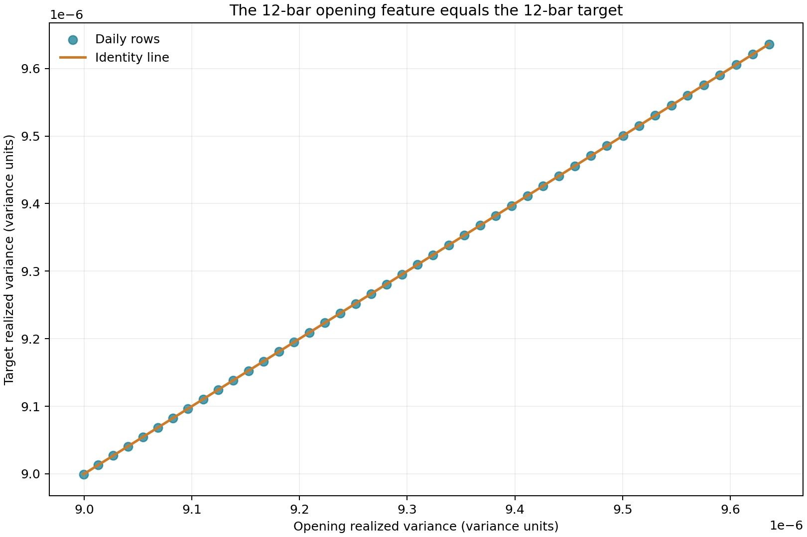

Une erreur absolue moyenne de $1.99 \times 10^{-14}$ pour un modèle linéaire de volatilité paraît exceptionnelle. Sur ce jeu de données, elle donne surtout une bonne raison de s'arrêter.

J'ai construit ce projet comme une chaîne de recherche utilisable hors ligne. Des barres de cinq minutes suivies dans le dépôt produisent une cible de variance réalisée. Un petit ensemble de variables alimente trois modèles transparents, puis des tests walk-forward transmettent la prévision à un modèle d'exécution simplifié. La plomberie est utile. La prévision apparemment parfaite ne prouve aucune qualité prédictive. Une variable est égale à la cible pour chaque journée modélisée.

La distinction dépasse ce projet. Une séparation chronologique peut empêcher l'apprentissage sur des observations futures tout en laissant une variable de la ligne test contenir la réponse de cette même ligne.

## L'expérience sur le papier

L'échantillon AAPL suivi dans le dépôt contient 55 jours de bourse. Chaque journée compte 12 barres de cinq minutes, de 09:30 à 10:25, heure de l'Est. La moyenne mobile sur dix jours élimine les dix premières observations, ce qui laisse 45 lignes quotidiennes pour la modélisation.

Pour le jour $d$ et la barre intrajournalière $t$, notons $P_{d,t}$ le cours de clôture en dollars. Le rendement logarithmique vaut

$$
r_{d,t}=\log\left(\frac{P_{d,t}}{P_{d,t-1}}\right).
$$

Le ratio $P_{d,t}/P_{d,t-1}$ n'a pas d'unité. Il en va donc de même pour $r_{d,t}$. La somme des carrés des rendements intrajournaliers disponibles donne la mesure approchée de variance réalisée du jour $d$ :

$$
RV_d=\sum_{t=1}^{T_d}r_{d,t}^2,
$$

où $T_d$ désigne le nombre de barres disponibles ce jour-là. La première barre n'a pas de clôture antérieure dans la même journée, et sa contribution est donc fixée à zéro par l'implémentation. Dans l'échantillon suivi, $T_d=12$ tous les jours. Il s'agit d'une mesure de variance sur l'heure d'ouverture, pas d'une variance quotidienne sur la séance complète.

La table de variables contient la variance réalisée pendant la fenêtre d'ouverture, le rendement d'ouverture, l'amplitude entre le plus haut et le plus bas, la part du volume négociée à l'ouverture, la variance réalisée de la veille ainsi que ses moyennes décalées sur cinq et dix jours. Le décalage précède le calcul des moyennes mobiles :

```python
merged["lag_1_realized_variance"] = merged.groupby("symbol")[
    "target_realized_variance"
].shift(1)

merged["rolling_5d_realized_variance"] = merged.groupby("symbol")[
    "target_realized_variance"
].transform(lambda values: values.shift(1).rolling(5, min_periods=5).mean())
```

Ce code traite correctement l'information historique. Chaque valeur décalée est connue avant la cible courante. Le problème vient d'une autre variable.

## La variable qui contient la réponse

Notons $m$ le nombre de barres de la fenêtre d'ouverture. Sa variance réalisée vaut

$$
RV_d^{(m)}=\sum_{t=1}^{m}r_{d,t}^2.
$$

L'expérience fixe $m=12$. Les données contiennent aussi exactement $T_d=12$ barres par jour. En remplaçant ces valeurs, on obtient

$$
RV_d^{(12)}=\sum_{t=1}^{12}r_{d,t}^2
$$

et

$$
RV_d=\sum_{t=1}^{T_d}r_{d,t}^2=\sum_{t=1}^{12}r_{d,t}^2.
$$

Les deux sommes contiennent les mêmes termes. Par conséquent,

$$
RV_d^{(12)}=RV_d.
$$

L'audit confirme une égalité exacte sur les 45 lignes du modèle. L'écart absolu maximal est de $0.0$ unité de variance.



Tous les points se trouvent sur la droite d'identité. La régression linéaire n'a pas à découvrir une relation stable. Elle peut recopier la cible par l'intermédiaire de `opening_realized_variance`.

Supposons que $x_{d,j}$ soit la variable $j$ au jour $d$, que $\beta_0$ soit la constante et que $\beta_j$ soit le coefficient de la variable $j$. Le modèle ajusté s'écrit

$$
\widehat{RV}_d=\beta_0+\sum_{j=1}^{p}\beta_j x_{d,j},
$$

où $p=7$ variables et $\widehat{RV}_d$ désigne la variance réalisée prévue. L'une de ces variables, notée $x_{d,1}$, est déjà égale à $RV_d$. La résolution par moindres carrés peut placer $\beta_1$ près de un, ramener les autres coefficients près de zéro et reproduire la cible à l'erreur d'arrondi près.

La procédure walk-forward place bien chaque bloc test de cinq jours après son bloc d'apprentissage de 20 jours. Elle empêche la fuite d'information provenant des lignes futures. Elle ne peut rien contre une fuite contemporaine à l'intérieur de $x_{d,1}$. Il s'agit de contrôles distincts :

| Contrôle | Ce qu'il empêche | État ici |
|---|---|---|
| Ordre chronologique apprentissage/test | Apprentissage sur des dates futures | Correct |
| Décalage des variables historiques de cible | Présence de la cible courante dans les entrées mobiles | Correct |
| Disponibilité de la variable à l'heure de prévision | Information du jour couvrant la même fenêtre que la cible | Échec |

## Ce que disent vraiment les mesures

Pour $N$ prévisions, notons $y_i$ la variance réalisée observée et $\widehat{y}_i$ sa prévision. L'erreur absolue moyenne, ou Mean Absolute Error (MAE), est

$$
MAE=\frac{1}{N}\sum_{i=1}^{N}\left|y_i-\widehat{y}_i\right|.
$$

La racine de l'erreur quadratique moyenne, ou Root Mean Squared Error (RMSE), s'obtient en élevant chaque erreur au carré, en calculant la moyenne, puis en prenant la racine carrée :

$$
RMSE=\sqrt{\frac{1}{N}\sum_{i=1}^{N}\left(y_i-\widehat{y}_i\right)^2}.
$$

Le projet calcule aussi la perte QLIKE, souvent employée pour évaluer des prévisions de variance. Pour une prévision strictement positive $\widehat{y}_i$, l'implémentation utilise

$$
QLIKE=\frac{1}{N}\sum_{i=1}^{N}\left[\log(\widehat{y}_i)+\frac{y_i}{\widehat{y}_i}\right].
$$

Une valeur plus basse est préférable pour les trois mesures lorsqu'on compare des prévisions sur la même échelle cible.

| Modèle | MAE moyenne | RMSE moyenne | QLIKE moyenne |
|---|---:|---:|---:|
| Linéaire | $1.9865 \times 10^{-14}$ | $2.1812 \times 10^{-14}$ | -10.599912 |
| Persistance | $1.4148 \times 10^{-8}$ | $1.4148 \times 10^{-8}$ | -10.599911 |
| Moyenne mobile sur cinq jours | $4.2574 \times 10^{-8}$ | $4.2574 \times 10^{-8}$ | -10.599901 |


L'échelle logarithmique rend l'écart immense visible. Il ne faut pas y voir un gain prédictif immense. L'erreur du modèle linéaire est le résidu numérique de la reconstruction de la cible. La persistance et la moyenne mobile sont les seuls véritables benchmarks prédictifs de ce tableau. L'échantillon reste trop étroit et trop lisse pour justifier une conclusion générale sur leurs performances.

L'affichage en ligne de commande cache un autre piège, plus petit. Les erreurs de variance y sont imprimées avec six chiffres après la virgule. Des valeurs proches de $10^{-8}$ deviennent `0.000000`, ce qui donne l'impression que les trois modèles sont exacts. La notation scientifique convient mieux à des quantités de cette taille.

## Le passage vers l'exécution et la question des unités

La seconde moitié du projet transforme une entrée de volatilité en programme d'exécution. Un ordre parent de 10,000 actions est réparti en six tranches. La stratégie Time-Weighted Average Price (TWAP) partage les actions uniformément. La stratégie pondérée par le volume suit le profil de volume observé. La version simplifiée d'Almgren-Chriss utilise une courbe hyperbolique pour l'inventaire restant.

Notons $\lambda$ le coefficient d'aversion au risque de l'ordre et $\sigma$ la volatilité quotidienne en valeur décimale. Le code définit l'urgence par

$$
u=\lambda\sigma.
$$

Pour un temps normalisé $t$ compris entre zéro et un, la fraction d'inventaire restante est

$$
x(t)=\frac{\sinh(u(1-t))}{\sinh(u)}.
$$

À $t=0$, le numérateur et le dénominateur valent tous deux $\sinh(u)$, donc $x(0)=1$. À $t=1$, le numérateur vaut $\sinh(0)=0$, donc $x(1)=0$. Une valeur plus élevée de $u$ déplace davantage l'exécution vers le début de l'horizon.

```python
if override_daily_volatility is not None:
    daily_volatility = float(max(override_daily_volatility, 0.0))

urgency = max(order.risk_aversion * market_state.daily_volatility, MIN_URGENCY)
```

L'interface appelle le paramètre de remplacement `daily_volatility`, mais la chaîne de recherche lui fournit $\widehat{RV}_d$, c'est-à-dire une prévision de variance. Variance et volatilité ne sont pas interchangeables. Lorsque les rendements sont exprimés en décimal, la conversion correcte est

$$
\widehat{\sigma}_d=\sqrt{\widehat{RV}_d}.
$$

Le passage actuel omet cette racine carrée. Il y a donc une incohérence d'unités à la frontière entre les modules. Une implémentation de production devrait aussi calibrer tous les paramètres d'Almgren-Chriss dans des unités de temps et de coût cohérentes, plutôt que d'employer $\lambda\sigma$ comme paramètre complet d'urgence.

Le simulateur impose une règle explicite d'impact fondée sur le taux de participation. Notons $q_k$ le nombre d'actions exécutées dans la tranche $k$ et $V_k$ le volume de marché dans la barre correspondante. Le taux de participation vaut $q_k/V_k$, et l'impact simulé en points de base est

$$
I_k=2+25\frac{q_k}{V_k}.
$$

Un point de base vaut $0.01\%$, soit $10^{-4}$ en notation décimale. Comme le coût augmente directement avec la participation, le simulateur pénalise une stratégie qui concentre les actions dans des barres à faible volume.


Almgren-Chriss et TWAP sont impossibles à distinguer visuellement à cette échelle, tandis que la stratégie de style VWAP coûte beaucoup plus cher sous la pénalité de participation du simulateur. Les valeurs exactes ci-dessous montrent à quel point le premier écart est faible.

| Stratégie | Coût moyen | Écart-type | 90e centile | Jours |
|---|---:|---:|---:|---:|
| Almgren-Chriss | 32.794536 bps | 0.457265 bps | 33.417538 bps | 55 |
| TWAP | 32.794760 bps | 0.457282 bps | 33.417782 bps | 55 |
| Style VWAP | 48.038066 bps | 0.613094 bps | 48.871924 bps | 55 |

Almgren-Chriss bat TWAP d'environ $0.000224$ point de base sur le coût moyen, une différence négligeable sur le plan économique. Son taux de victoire de 100% contre TWAP paraît plus fort que l'amplitude réelle de l'écart. La stratégie de style VWAP coûte environ $15.24$ points de base de plus que TWAP dans ce simulateur. Ce résultat décrit le profil de volume et la règle d'impact linéaire retenus. Il ne fournit pas un classement général des algorithmes d'exécution.

## Une prochaine expérience défendable

Cette chaîne peut devenir une étude de prévision utile sans modèle compliqué. Il faut d'abord corriger le contrat de données.

1. Employer des barres couvrant toute la séance afin que la cible s'étende au-delà de la période utilisée pour construire les variables d'ouverture.
2. Choisir une coupure d'ouverture strictement antérieure à la fin de la cible. On peut, par exemple, construire les variables jusqu'à 10:30 et prévoir la variance entre 10:30 et 16:00.
3. Enregistrer une heure de disponibilité pour chaque variable. Une variable n'est valide que si elle existe au moment de la prévision.
4. Réévaluer la persistance et les moyennes mobiles avant d'ajuster le modèle linéaire. La complexité ne se justifie qu'après validation des benchmarks simples.
5. Convertir la variance prévue en volatilité avec $\widehat{\sigma}_d=\sqrt{\widehat{RV}_d}$ avant de franchir l'interface d'exécution.
6. Tester la sensibilité de la stratégie à l'aversion au risque, à la taille de l'ordre, à l'horizon et aux coefficients d'impact. Les différences économiques comptent davantage qu'un taux de victoire isolé.

Le dépôt dispose déjà d'une bonne frontière hors ligne, de petites fonctions et d'une mécanique walk-forward reproductible. Les données actuelles enseignent quelque chose de plus précis. Une séparation propre est nécessaire, mais la disponibilité au moment de la prévision définit une variable utilisable. Devant une mesure d'erreur parfaite, le premier réflexe doit être de retracer la cible, pas de célébrer le modèle.
