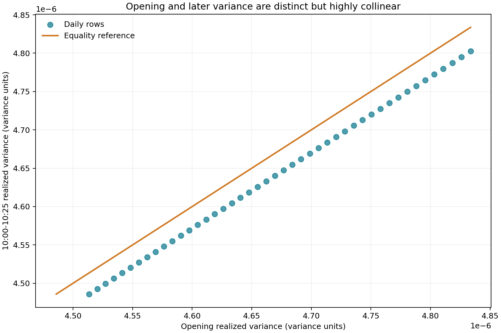
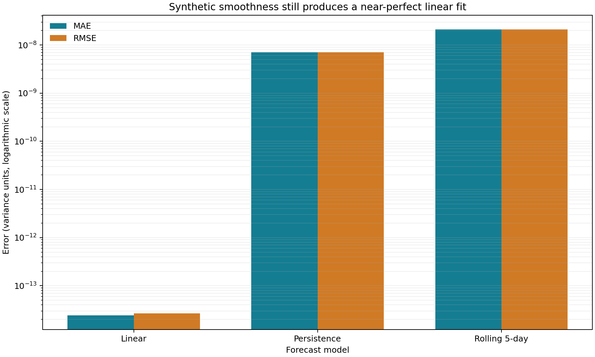
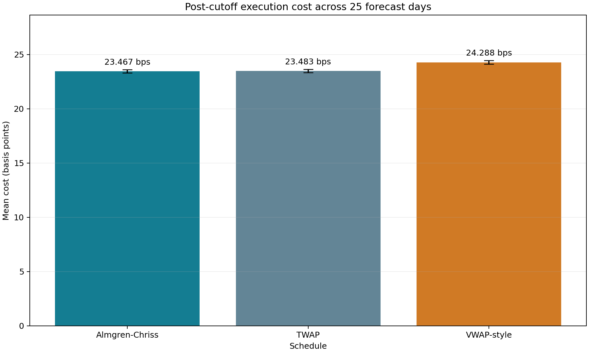

A forecast is only usable if every input exists when the forecast is issued. Its output must also have the units expected by the next model. The first version of this project failed both tests. The opening variance feature covered all 12 tracked bars, so it equaled the target. The resulting variance forecast then crossed an interface documented as volatility without a square root.

The repaired pipeline makes one decision at 09:55 Eastern Time. Six five-minute bars are known by then. The model forecasts variance over the next six bars, and the simulated parent order starts at 10:00. That simple timeline fixes the causal error. A second correction converts forecast variance into volatility before it affects execution urgency.

The corrected result needs an honest warning: the linear model still posts a Mean Absolute Error (MAE) of $2.44\times10^{-14}$. That is not evidence of market forecasting skill. The tracked fixture is deterministic and smooth enough that opening and later variance have a correlation of $0.999999998$ even though they no longer overlap.

## The decision timeline

The tracked AAPL sample contains 55 trading days. Each day has 12 five-minute bars from 09:30 through 10:25 Eastern Time. Let $d$ denote a trade date, $t\in\{0,\ldots,11\}$ denote a bar index, and $P_{d,t}$ denote the bar close in dollars.

The close-to-close log return is

$$
r_{d,t}=\log\left(\frac{P_{d,t}}{P_{d,t-1}}\right).
$$

The ratio inside the logarithm is unitless, so $r_{d,t}$ is unitless. The first bar has no previous close within the same day and contributes no within-day return.

Set the information cutoff to $m=6$ bars. The opening feature uses returns ending before the cutoff:

$$
RV^{\text{open}}_d=\sum_{t=1}^{m-1}r_{d,t}^{2}.
$$

Here $RV^{\text{open}}_d$ is opening realized variance. It is known after the 09:55 close. The target uses returns whose ending closes arrive later:

$$
RV^{\text{rem}}_d=\sum_{t=m}^{11}r_{d,t}^{2}.
$$

Here $RV^{\text{rem}}_d$ is remaining-window realized variance. Its first term is the return from the known 09:55 close to the unknown 10:00 close. No target return exists at forecast time.

<pre>
09:30                 09:55  10:00                 10:25
|------ 6 known bars ------| |------ 6 future bars ------|
       feature window       ^       target/execution
                             forecast and order arrival
</pre>

This construction follows the standard realized-volatility idea of estimating variation by summing high-frequency squared returns, but over a deliberately short teaching window rather than a full trading day. Andersen, Bollerslev, Diebold, and Labys give the broader empirical foundation for realized volatility in financial returns.[^1]

The product code now rejects any session without at least one bar after the cutoff:

```python
bar_counts = returns_frame.groupby(["symbol", "trade_date"]).size()
invalid_sessions = bar_counts.loc[bar_counts <= opening_window_bars]
if not invalid_sessions.empty:
    raise ValueError(
        "Each session must contain at least one bar after opening_window_bars."
    )

remaining_frame = returns_frame.loc[
    returns_frame["bar_index"] >= opening_window_bars
].copy()
```

The guard matters because a zero-length future window would quietly recreate the original problem or produce a meaningless zero target.

## Features available at 09:55

The linear model uses seven predictors. Four come from the current opening window:

- opening realized variance;
- opening log return;
- opening high-low range divided by the opening price;
- $\log(1+V^{\text{open}}_d)$, where $V^{\text{open}}_d$ is opening share volume.

Three predictors summarize previous remaining-window targets:

$$
L_{d,1}=RV^{\text{rem}}_{d-1},
$$

$$
M_{d,k}=\frac{1}{k}\sum_{j=1}^{k}RV^{\text{rem}}_{d-j},\qquad k\in\{5,10\}.
$$

Here $L_{d,1}$ is the one-day lag and $M_{d,k}$ is a trailing mean over $k$ prior trading days. The shift happens before the rolling average:

```python
merged["lag_1_remaining_realized_variance"] = merged.groupby("symbol")[
    "target_remaining_realized_variance"
].shift(1)

merged["rolling_5d_remaining_realized_variance"] = merged.groupby("symbol")[
    "target_remaining_realized_variance"
].transform(lambda values: values.shift(1).rolling(5, min_periods=5).mean())
```

The old feature divided opening volume by total tracked-window volume. Its denominator included bars after 09:55, so it was not known when the forecast was issued. Replacing it with log opening volume closes that smaller leak and keeps the predictor on a manageable numerical scale.

The revised feature and target differ on every modeled day. Their smallest absolute difference is $2.756\times10^{-8}$ variance units.



The points do not sit on the equality line, so the feature no longer contains the target. They form an almost straight curve because the fixture generates very smooth, deterministic price paths. Causal separation fixed the research design; it did not turn this sample into market evidence.

## Walk-forward models and losses

Ten prior targets are required for the longest rolling feature, leaving 45 modeling rows. Each walk-forward split trains on 20 consecutive rows and tests on the next five. The window advances by five rows, producing five non-overlapping test blocks and 25 out-of-sample forecasts.

The three models are deliberately small:

1. Persistence predicts $\widehat{RV}^{\text{rem}}_d=L_{d,1}$.
2. The rolling baseline predicts $\widehat{RV}^{\text{rem}}_d=M_{d,5}$.
3. Ordinary least squares estimates

$$
\widehat{RV}^{\text{rem}}_d=\beta_0+\sum_{j=1}^{7}\beta_jx_{d,j},
$$

where $x_{d,j}$ is predictor $j$, $\beta_0$ is an intercept, and $\beta_j$ is its fitted coefficient. For a design matrix $X$ and target vector $y$, ordinary least squares chooses the coefficient vector $\widehat{\beta}$ that minimizes squared residuals:

$$
\widehat{\beta}=\arg\min_{b}\lVert Xb-y\rVert_2^2.
$$

For $N$ forecasts, actual variance $y_i$, and predicted variance $\widehat{y}_i$, MAE is

$$
\operatorname{MAE}=\frac{1}{N}\sum_{i=1}^{N}|y_i-\widehat{y}_i|.
$$

Root Mean Squared Error (RMSE) is

$$
\operatorname{RMSE}=\sqrt{\frac{1}{N}\sum_{i=1}^{N}(y_i-\widehat{y}_i)^2}.
$$

The QLIKE loss used in the code is

$$
\operatorname{QLIKE}=\frac{1}{N}\sum_{i=1}^{N}\left[\log(\widehat{y}_i)+\frac{y_i}{\widehat{y}_i}\right].
$$

Predictions are floored at $10^{-12}$ before QLIKE so its logarithm and division are defined. Patton explains why loss functions robust to a noisy volatility proxy matter when comparing volatility forecasts.[^2]

| Model | MAE (variance units) | RMSE (variance units) | Mean QLIKE |
|---|---:|---:|---:|
| Linear | $2.438\times10^{-14}$ | $2.678\times10^{-14}$ | -11.296174 |
| Persistence | $7.034\times10^{-9}$ | $7.034\times10^{-9}$ | -11.296173 |
| Rolling 5-day | $2.117\times10^{-8}$ | $2.117\times10^{-8}$ | -11.296163 |



The logarithmic axis shows the large numerical gap. The right interpretation is narrow: a linear combination of highly collinear synthetic features can extrapolate this fixture almost exactly. There are only 20 training observations for seven predictors plus an intercept, no realistic noise, and no independent market sample. The result verifies plumbing. It does not validate a trading model.

## Variance is not volatility

The execution schedule accepts volatility, denoted by $\sigma$, in decimal return units. The research model predicts variance, denoted by $RV$, in squared-return units. The conversion follows directly from the definition of variance:

$$
\operatorname{Var}(r)=\sigma^2.
$$

Taking the non-negative square root gives

$$
\widehat{\sigma}^{\text{rem}}_d=\sqrt{\widehat{RV}^{\text{rem}}_d}.
$$

If predicted variance is $4\times10^{-6}$, passing that number as volatility supplies $0.000004$. The correct volatility is $0.002$, or 20 basis points of return. The incorrect interface crossing understates the input by a factor of 500 in this example.

The repaired execution bridge performs the conversion explicitly and rejects negative or non-finite variance forecasts:

```python
predicted_variance = float(forecast_variance_by_trade_date[trade_date])
if predicted_variance < 0.0 or not np.isfinite(predicted_variance):
    raise ValueError("Variance forecasts must be finite and non-negative.")

predicted_volatility = float(np.sqrt(predicted_variance))
```

The simplified Almgren-Chriss schedule defines urgency as

$$
u=\max(\lambda\sigma,10^{-6}),
$$

where $\lambda$ is the configured risk-aversion coefficient and $\sigma$ is remaining-window volatility. At normalized time $\tau\in[0,1]$, the fraction of inventory remaining is

$$
x(\tau)=\frac{\sinh(u(1-\tau))}{\sinh(u)}.
$$

Larger $u$ bends the inventory path toward earlier execution. The project borrows the risk-cost trade-off and hyperbolic inventory shape associated with Almgren and Chriss, but it is a teaching approximation rather than their fully calibrated temporary and permanent impact model.[^3]

## Post-cutoff execution results

For each of the 25 forecast dates, the order arrives after the 09:55 close. The arrival benchmark is that last known close. Schedules trade against the six bars from 10:00 through 10:25. A 10,000-share buy order is compared across Time-Weighted Average Price (TWAP), the simplified Almgren-Chriss path, and a Volume-Weighted Average Price (VWAP) schedule.

For slice $i$, let $q_i$ be executed shares and $V_i$ be market volume. The simulator uses participation $q_i/V_i$ and impact

$$
I_i=2+25\frac{q_i}{V_i}
$$

in basis points. If $P_i$ is the bar close, the buy fill is

$$
P_i^{\text{fill}}=P_i\left(1+\frac{I_i}{10{,}000}\right).
$$

Let $P^{\text{arr}}$ be the 09:55 arrival price and $Q=\sum_iq_i$ the parent-order size. Total implementation shortfall in basis points is

$$
C_{\text{bps}}=10{,}000\frac{\sum_iq_i(P_i^{\text{fill}}-P^{\text{arr}})}{P^{\text{arr}}Q}.
$$

The corrected reporting code uses this arrival-price notional and weights average fill price by shares. Earlier code averaged slice costs, which gives a small slice the same influence as a large one.

| Schedule | Mean cost (bps) | Median (bps) | Standard deviation (bps) | 90th percentile (bps) | Days |
|---|---:|---:|---:|---:|---:|
| Almgren-Chriss | 23.467 | 23.466 | 0.152 | 23.667 | 25 |
| TWAP | 23.483 | 23.482 | 0.152 | 23.682 | 25 |
| VWAP oracle | 24.288 | 24.285 | 0.157 | 24.495 | 25 |



Almgren-Chriss beats TWAP by about $0.016$ basis points on average in this simulator. That difference is tiny and depends on the chosen risk aversion and impact constants. The VWAP schedule is an oracle benchmark because it allocates shares using the realized volumes of future bars. It is costlier here because the toy impact rule penalizes high participation; this says more about the simulator than about VWAP in live execution.

Bertsimas and Lo frame execution as a dynamic optimization problem under price impact and information arrival.[^4] This project does not solve that full problem. It has no order book, spread dynamics, queue position, temporary-versus-permanent impact calibration, or venue choice.

## What the repair establishes

The corrected code now enforces one coherent chain:

<pre>
bars ending by 09:55
        -> causal features
        -> forecast 10:00-10:25 variance
        -> square root to volatility
        -> parent order arrives
        -> simulate only 10:00-10:25 bars
</pre>

That chain fixes the two material defects and two related issues uncovered during the trace. It does not rescue the empirical claim. A useful next experiment needs full-session market data, a realistic noise structure, substantially more training history, and an execution model whose impact parameters are estimated rather than chosen constants.

The main lesson is procedural. A chronological train-test split cannot repair a feature whose timestamp crosses the decision boundary. Passing tests cannot repair a unit mismatch between modules. Trace time and units before interpreting a metric.

## References

[^1]: Andersen, T. G., Bollerslev, T., Diebold, F. X., and Labys, P. (2003). [Modeling and Forecasting Realized Volatility](https://doi.org/10.1111/1468-0262.00418). *Econometrica*, 71(2), 579-625.
[^2]: Patton, A. J. (2011). [Volatility Forecast Comparison Using Imperfect Volatility Proxies](https://doi.org/10.1016/j.jeconom.2010.03.034). *Journal of Econometrics*, 160(1), 246-256.
[^3]: Almgren, R., and Chriss, N. (2001). [Optimal Execution of Portfolio Transactions](https://doi.org/10.21314/JOR.2001.041). *Journal of Risk*, 3(2), 5-39.
[^4]: Bertsimas, D., and Lo, A. W. (1998). [Optimal Control of Execution Costs](https://doi.org/10.1016/S1386-4181(97)00012-8). *Journal of Financial Markets*, 1(1), 1-50.
